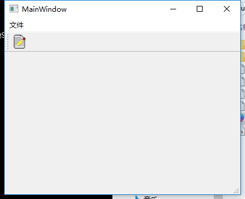

```
QToolBar *toolbar = new QToolBar(this);
RunTool = new QAction(QIcon("://ico/Start_48px.ico"), "&运行", this);
RunTool->setShortcut(tr("Ctrl+R"));
RunTool->setStatusTip(tr("运行"));
RunTool->setCheckable(true);
toolbar->addAction(RunTool);
toolbar->addWidget(new QLabel("倒计时",this));
connect(RunTool, SIGNAL(triggered(bool)), this, SLOT(runing(bool)));


void Widget::runing(bool status)
{
    if(status)
    {
        RunTool->setIcon(QIcon("://ico/Stop_red_48px.ico"));

    }else{
        RunTool->setIcon(QIcon("://ico/Start_48px.ico"));

    }

}


```


```
QAction *newFile = new QAction(QIcon("newproject.png"), tr("新建"), this);
newFile->setShortcut(tr("Ctrl+O"));
newFile->setStatusTip(tr("新建"));
connect(newFile, SIGNAL(triggered()), this, SLOT(newFile()));

//菜单栏天添加
QMenu *fileMenu = menuBar()->addMenu(tr("文件"));
fileMenu->addAction(newFile);

//工具栏
QToolBar *toolbars = addToolBar("File");
toolbars->addAction(newFile);

```

